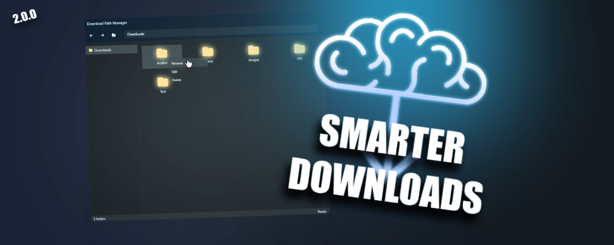
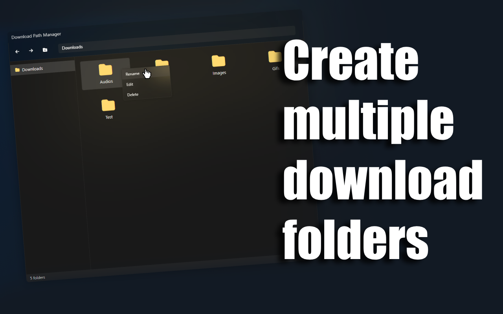
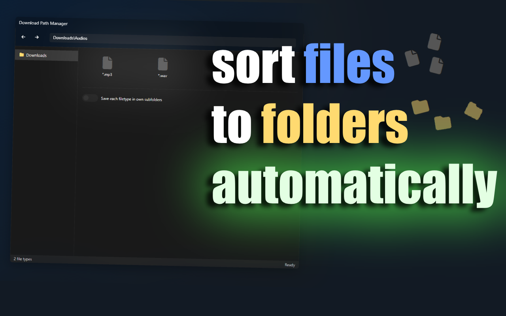

# Smarter Downloads 

## Overview

 *Customize download paths based on file types with an easy to understand Windows Explorer interface.*

>[!IMPORTANT]  
> This extension cannot create folders outside your browser's configured default download directory<br/> 
> For example: C:\Users\[You]\Downloads<br/>
> All organizational folders and rules must be subdirectories within this location




## What's New in v2
**Complete Windows Explorer UI redesign**<br/> 
Kinda looks and works like the Windows File Explorer

**Visual folder navigation**<br/> 
Browse folders like in Windows Explorer

**Improved path switching**<br/> 
Faster and more reliable file sorting

**Simplified setup**<br/>
Right-click context menus and intuitive controls

**New code structure**<br/>
Easier maintenance and future updates

**Create folders**<br/>
Create folders or filetypes wherever you want and create your own rules

## What's on my list?

**Multiselect**<br/>
Being able to select multiple files

**Custom rules (general)**<br/>
For example: different paths for different websites

**Custom rules (filetypes)**<br/>
For example: only save to a specific location if the name contains specific characters

## Usage





**Getting Started:**
1. Click the extension icon in your browser toolbar
2. The Windows File Explorer-style interface will open

**Managing Download Paths:**
- **Right-click on folders** to rename, edit,or delete
- **Double-click folders** to open the folder
- **Right-click in empty space** to add a new folder or to add new file types, which are automatically saved to this location

**Saving & Data:**
- All settings auto-save locally after each change
- Persists across browser sessions
- Cleared when you uninstall the extension

## Development

### Building
```bash
npm install
npm run dev
npm run build