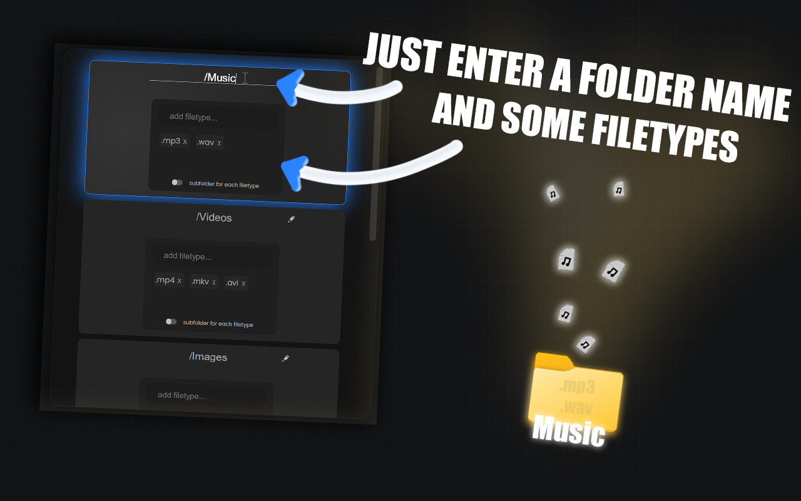

# Smarter Downloads 

## Overview
> [!NOTE]
> This extension allows you to customize the download path for files based on file types and folder names. You can specify every file type in the settings and let it automatically download to the specified folder.

## Usage

**How Do i Start?:**

- *Click on the extension icon (the location may vary depending on your browser).*
- *The Settings Page should open.*

**Changing Folder Names:**
- *Click on the pencil icon next to the folder name to edit it.*
- *Press Enter or click somewhere else to save changes.*

**Filter Filetypes:**
- *Click on the **add filetype..** input and type your filetypes.*
- *Press Enter or use commas to seperat multiple filetypes.*
- *Click on the **X** of the filetype to remove a filetype.*

**Subfolder Option:**
- *Toggle the checkbox to create your own subfolders for each file type.*
- *The names of the subfolders will correspond to the file type names (e.g., Music/MP4).*

**Saving:**
- *Settings are saved locally and will persist across browser sessions.*
- *Settings will be cleared when you remove the extension.*

>## File Descriptions:
>- `background.js`: Mainly manages the download paths based on the stored settings.
>- `settingsHandler.js`: Handles UI events and updates frontend storage on setting changes.
>- `htmlHandler.js`: Handles HTML event such as animations, cursor glow, smooth scroll..
>- `minify.js`: Minify files and images with 'npm run minify', use npm install beforehand.
