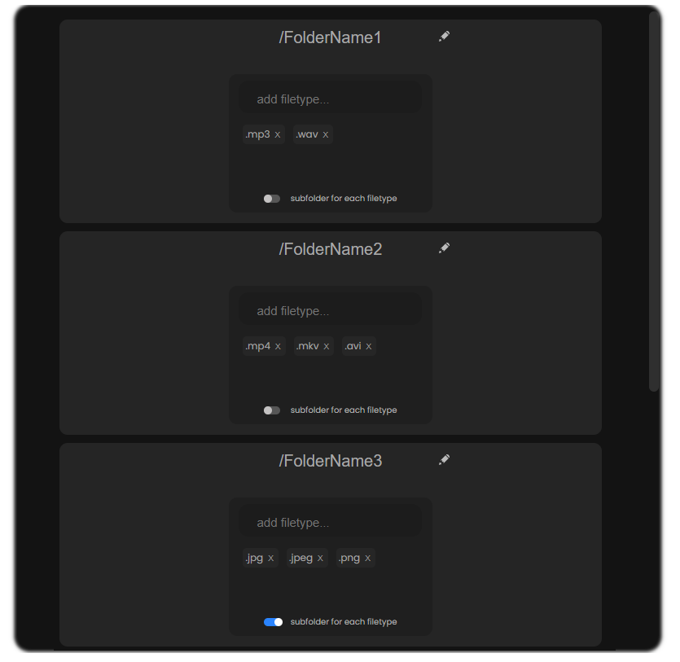

# Smarter Downloads 

## Overview
> [!NOTE]
> This extension allows you to customize the download path for files based on file types and folder names. You can specify every file type in the settings and let it automatically download to the specified folder.

## Usage

**Customizing Folders:**
- *Click on the extension icon in the toolbar.*
- *Configure folder names and file types in the extension settings.*

**Subfolder Option:**
- *Toggle checkboxes to create subfolders for each file type.*
- *Activating a subfolder for a file type will organize downloads accordingly.*

**File Type Tags:**
- *Specify file types using tags in the settings.*
- *Press Enter or use commas to add multiple file types.*

**Changing Folder Names:**
- *Click on the pencil icon next to the folder name to edit it.*
- *Press Enter or click somewhere else to save changes.*

**Storing:**
- *Settings are saved locally, persisting across browser sessions.*
- *Settings are cleared as soon as you remove the extension.*

>## File Descriptions:
>- `background.js`: Mainly manages the download paths based on the stored settings.
>- `settingsHandler.js`: Handles UI events and updates frontend storage on setting changes.
>- `htmlHandler.js`: Handles HTML event such as, animations, cursor glow, smooth scroll..

[^1]: i consider the everything else to be self-explanatory.
